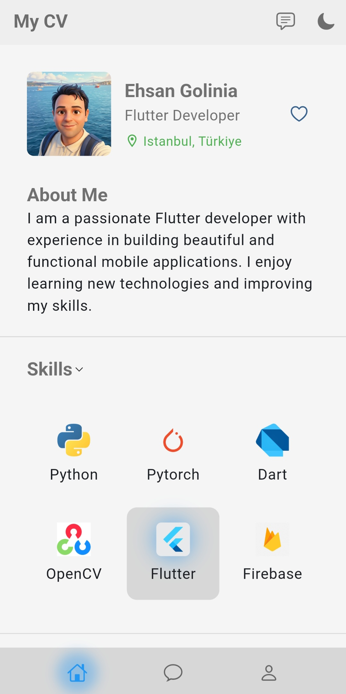
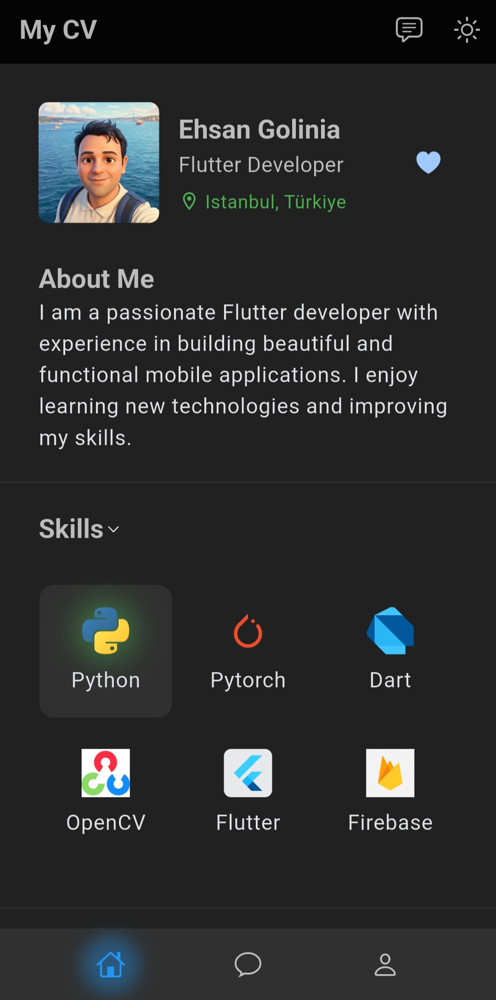
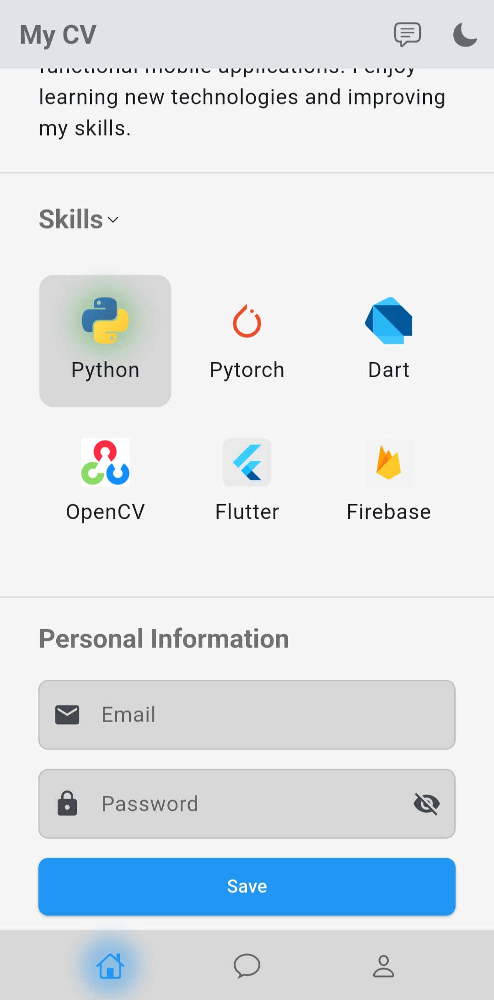
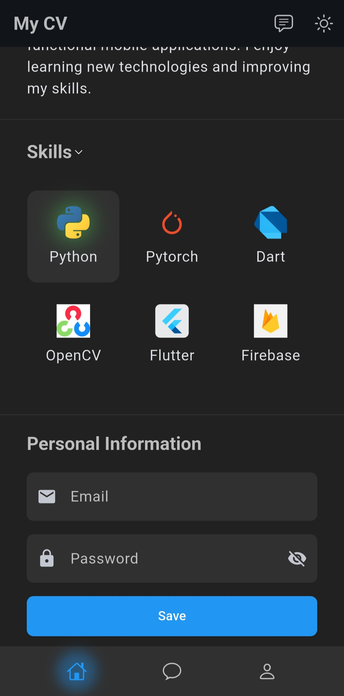

# 📱 My First Flutter Portfolio App

A sleek, animated personal CV/portfolio app built with **Flutter**, featuring dynamic theming, multi-language support, and a modern, interactive UI.

<p align="left">
  
  
  
  
</p>

---

## ✨ Overview

**My CV** is a native mobile app that presents a personal résumé in a clean, mobile-first UI — built as a hands-on learning project to practice professional Flutter architecture: theming, state management, localization, and custom UI components.

| Light Mode | Dark Mode |
|---|---|
|  |  |
|  |  |

---

## 🚀 Features

- 🎨 **Dynamic Light/Dark Theme** — toggle instantly via the app bar, powered by Material 3 `ColorScheme.fromSeed`
- 🌍 **Multi-language Support** — switch between **English 🇬🇧** and **Turkish 🇹🇷** on the fly, with locale-aware fonts
- 🧩 **Interactive Skills Grid** — tap to highlight a skill with a soft animated glow effect
- 🔐 **Password Field with Visibility Toggle** — show/hide password input, styled to match the app theme
- ❤️ **Favorite Toggle** — animated fill/outline heart icon interaction
- 🧭 **Custom Floating Bottom Navigation** — hand-built nav bar with an animated glow on the selected tab
- 🖋️ **Custom Typography** — Google Fonts (Lato) integrated via `google_fonts`, with locale-specific font fallback
- 📱 **Fully Responsive Layout** — built with `SingleChildScrollView`, `Expanded`, and `Wrap` to adapt across screen sizes

---

## 🛠️ Tech Stack

| Category | Tool / Package |
|---|---|
| Framework | [Flutter](https://flutter.dev) |
| Language | [Dart](https://dart.dev) |
| Fonts | [`google_fonts`](https://pub.dev/packages/google_fonts) |
| Localization | `flutter_localizations`, `intl`, ARB-based `AppLocalizations` |
| State Management | Native Flutter `StatefulWidget` + `setState` |
| CI/CD | GitHub Actions (automated release APK builds) |

---

## 📦 Download

Prebuilt release APKs are available on the [**Releases**](../../releases) page — no build setup required.

1. Go to [Releases](../../releases)
2. Download the latest `my-first-flutter-app-v*.*.*.apk`
3. Install on your Android device (you may need to allow "Install from unknown sources")

---

## 🧑‍💻 Getting Started (Run Locally)

Follow these steps to clone the repo and run the project on your own machine.

### Prerequisites

Make sure you have the following installed:

- [Flutter SDK](https://docs.flutter.dev/get-started/install) (3.35.x or later recommended)
- [Android Studio](https://developer.android.com/studio) or [VS Code](https://code.visualstudio.com/) with the Flutter extension
- An Android/iOS emulator, or a physical device with USB debugging enabled
- [Git](https://git-scm.com/)

Verify your Flutter setup is healthy:

```bash
flutter doctor
```

### 1. Clone the repository

```bash
git clone https://github.com/ehsan-golinia/my_first_flutter_app.git
cd my_first_flutter_app
```

### 2. Install dependencies

```bash
flutter pub get
```

### 3. Run the app

Make sure an emulator is running or a device is connected, then:

```bash
flutter run
```

### 4. (Optional) Build a release APK yourself

```bash
flutter build apk --release
```

The output APK will be located at:

```
build/app/outputs/flutter-apk/app-release.apk
```

---

## 📁 Project Structure

```
lib/
 ├── main.dart              # App entry point, theming, and locale setup
 ├── l10n/                  # Localization files (ARB + generated AppLocalizations)
assets/
 └── images/                # Profile photo and skill icons
.github/
 └── workflows/             # GitHub Actions CI/CD (auto-build & release APK on tag push)
```

---

## 🌐 Localization

This app supports **English** and **Turkish**. Translations are managed via `.arb` files under `lib/l10n/`.

To add a new language:

1. Create a new `app_<locale>.arb` file (e.g. `app_de.arb`) in `lib/l10n/`
2. Add the translated key-value pairs
3. Run:
   ```bash
   flutter gen-l10n
   ```
4. Add the new locale to `supportedLocales` in `main.dart`

---

## 📄 License

This project is licensed under the [MIT License](LICENSE).

---

## 👤 Author

**Ehsan Golinia**
Flutter Developer — Istanbul, Türkiye

- GitHub: [@ehsan-golinia](https://github.com/ehsan-golinia)

---

<p align="center">Made with ❤️ and Flutter</p>